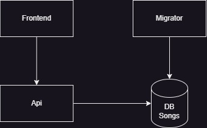

# aspire-db-demo

De opdracht bestaat uit een 1ste kennismaking met Aspire. We gaan een simpele applicatie bouwen met daarin een 2-tal microservices die gebruik maken van een entity framework database. Het is een stap voor stap opdracht die je meeneemt in de basis van Aspire en een de applicatie laat deployen op Azure. De final state waar we naartoe gaan werken. In 1ste instantie hebben we enkel de front-end en een database.

- [Assignment 1](/workshop/step-1/step-1.md)
- [Assignment 2](/workshop/step-2/step-2.md)
- [Assignment 3](/workshop/step-3/step-3.md)
- [Assignment 4](/workshop/step-4/step-4.md)
