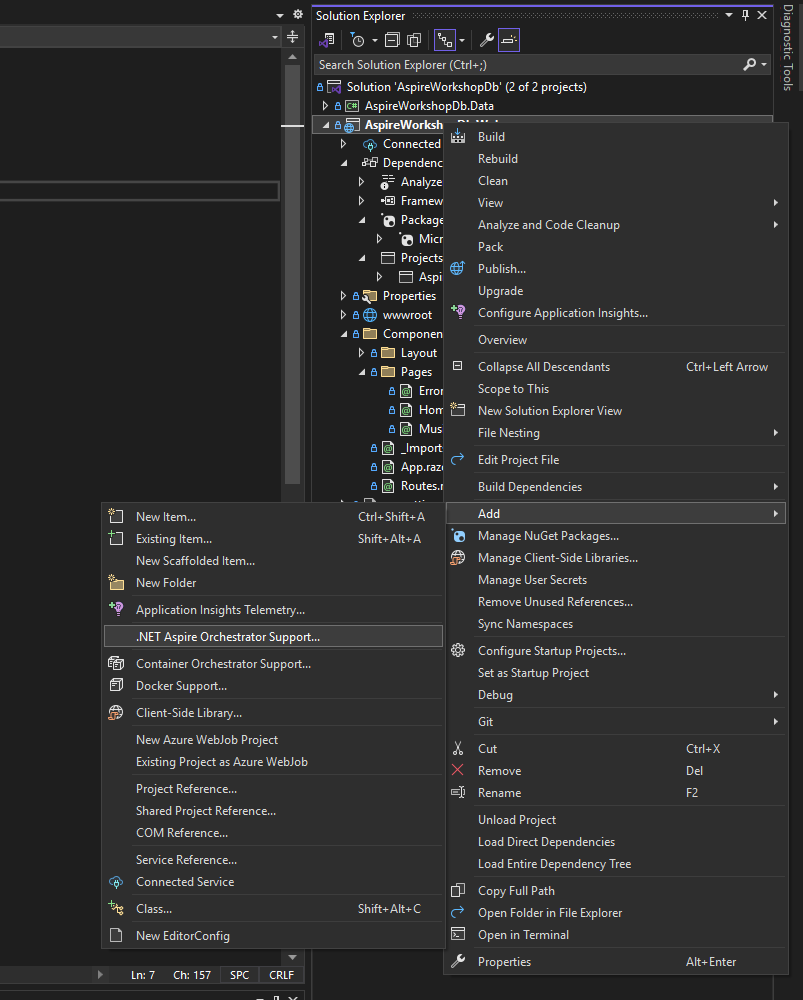

# Opdracht convert to Aspire
 
 De 1ste opdracht bestaat uit de bestaande oplossing aanpassen om aspire te initialiseren. Het doel is om een dashboard te tonen met de draaiende appplicatie en deze te starten. Verder zullen we gebruik gaan maken van SQL Containers.

 ### Stap 1.1)
 Nadat je gecontroleer hebt of het project opstart is het tijd om Aspire Support toe te gaan voegen volg de stap op de afbeelding



### Stap 1.2)
Nadat je Aspire hebt geinitialiseerd zou je moeten zien dat de applicatie nog steeds werkt en dat er een dashboard gaat launchen met daarin 1 enkele container

Bekijk daarbij de onderstaande methodes die zijn toegevoegd aan de webApp

```c#
builder.AddServiceDefaults();

app.MapDefaultEndpoints();
```

### Stap 1.3)
Nu we de applicatie draaiend hebben willen we niet meer connecten naar een local db maar willen we connecten naar een **SQLServer Container**. Voeg daarom de juiste Nuget package toe aan het AppHost Project **(Aspire.Hos...)**.

Nadat de juiste package is gevonden kan het volgende worden toegevoegd aan het AppHost project

```c#
var sql = builder.AddSqlServer("mysqlservername")
                .WithLifetime(ContainerLifetime.Persistent)
                .AddDatabase("mydatabasename");
```

Nu dien je de database te koppelen aan het project. Probeer met behulp van intellisense te kijken hoe je de database koppelt in het app host project

### Stap 1.4)

Zorg ervoor dat je in appsettings.json de connectionstring verwijderd en run het project.

Open in het Aspire Dashboard en kijk of je hier een connectionstring kan vinden en connect er is mee met een SQL Management Studio of Azure Data Studio

### Stap 1.5

Wat opvalt is dat je helemaal geen dedicated package nodig hebt omdat aspire zelf een connectionstring published. Echter in de docs van Microsoft staat dat je ook de wrapper mag gebruiken omdat deze meer mogelijkheden biedt. Vervang daarom in het web project de nuget package door de Aspire variant.

```c#
builder.AddSqlServerDbContex<>(...)
```

### Stap 1.6
Nu is het tijd om de applicatie te deployen op Azure open de solution folder in powershell of bash en run de volgende commands. Let op dat je niet vergeet de app beschikbaar te stellen met **WithExternalEndpoints**

```pshell
azd init
azd up
azd monitor
```