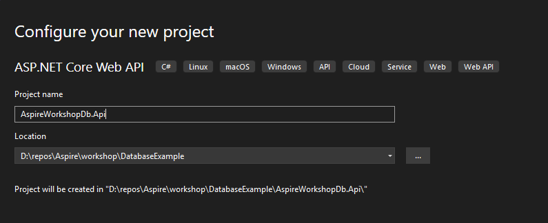

# Opdracht 2 Add Api    
 
In deze opdracht beginnen we met het toevoegen van een api om onze muziek op te halen.

### Stap 2.1)

Maak een nieuw Api Project aan als het goed is zou je zonder problemen de weatherforecast moeten kunnen aanroepen.


### Stap 2.2)

Nu we de api hebben draaien willen we een api maken die een song kan ophalen en kan wegschrijven om een voorbeeld te geven hoe je dat doet bij deze een voorbeeld

```c#
public static class SongApis
{
    public static void MapGroupSongEndpoints(this IEndpointRouteBuilder routes)
    {
        var group = routes.MapGroup("/api");

        group.WithTags("Songs");

        group.MapGet("/songs", GetSongs);
        group.MapPost("/song", AddSong);
    }

    private static async Task<List<Song>> GetSongs(
       CollectionContext context) => ....

```

Je zou nu zelf in staat moeten zijn om de database aan het project te koppelen. Bij het starten zou nu de url ...api/songs moeten zijn te raadplegen op de api

### Stap 2.3)

Maak in het web project een client aan om de api's aan te roepen vb:
```c#
 public class SongsClient(HttpClient client) : ISongsClient
 {
     public async Task<List<Song>> GetSongsAsync() =>
        await client.GetFromJsonAsync<List<Song>>("/api/songs");

....
```

Let op dat je de httpclient toevoegt in de program.cs met het juiste base addres

```
builder.Services.AddHttpClient..(
    static client....
```

### Stap 2.4)

Nu alles services beschikbaar zijn is het zaak om in het web project alle entity framework packages te verwijderen en in de MusicCollection.razor de httpclient (service) te implementeren.

Controleer of alles werkt en check ook of de traces via de api gaan


### Stap 2.5)

Deploy de nieuwe services middels de azure developer cli en kijk of dezelfde werking ook zo werkt op Azure.

Vraag? Is WithExternalEndPoints nodig?


