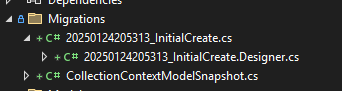

# Opdracht 3 EntityframeWork Migrations

De volgende stap is het toevoegen van entityframework met daarbij behorende migraties. Net zoals ieder ander project wil je dat migraties worden uitgevoerd alvorens de Api wordt gestart en bouwen we een migrator project die start alvorens de api met de database start

### Stap 3.1)

Maak een nieuwe Console applicatie aan met de naam `AspireWorkshopDb.Migrator` Let op dat bij het aanmaken geen Aspire wordt opgenomen in het project. Voeg dit toe vanuit de solution explorer

### Stap 3.2)
Voeg de EFCore migratie toe aan het data project. Doe ditr door de volgende stappen uit te voeren.

Voeg aan het `Api` project de volgende Nuget package toe `Microsoft.EntityFrameworkCore.Design` Open vervolgens powershell en voer het onderstaande commando uit om de migraties aan te maken. Doe dit vanuit de folder waar het api project staat

```ps
dotnet ef migrations add InitialCreate --project ..\AspireWorkshopDb.Data\AspireWorkshopDb.Data.csproj
```

Het volgende zou nu zichtbaar moeten zijn in de solution



### Stap 3.2)

Een volgende stap is het maken van een background service die de migratie uitvoert. Om dit wat eenvoudiger te maken kun je de volgende code gebruiken. [code worder class](code-worker.md) 

Een volgende stap is het aanroepen van de service vanuit de program.cs
[voorbeeld](https://learn.microsoft.com/en-us/dotnet/aspire/database/ef-core-migrations#create-the-migration-service)


### Stap 3.3)
De volgende stap is de verschillende onderdelen aanroepen vanuit de orchestrator. Dit zou nu niet meer zo moeilijk moeten zijn. Let wel dat sinds Aspire 9.x we de commando's `WaitFor` en `WaitForCompletion` hebben.

### Stap 3.4)
Vergeet de oude migration code niet te verwijderen. (We willen niet dat het 2 keer wordt uitgevoerd)

### Stap 3.5)
Provision to Azure en kijk of de onderdelen werken zoals verwacht.
