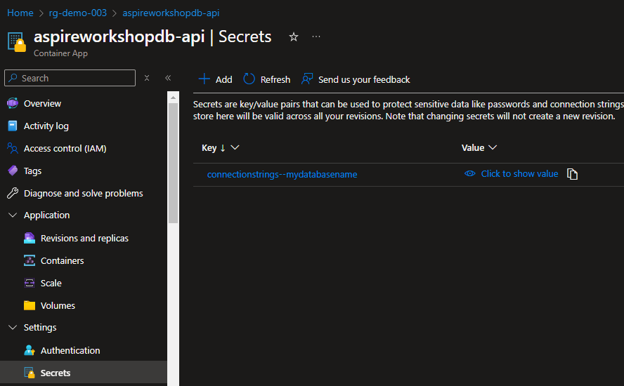

# Opdracht 4 connectie maken naar een local db

Hoe leuk het ook is om iedere keer een container op te starten met MS SQL kan het ook leuk zijn om een eigen SQL database te benaderen of een managed Instance in SQL daarvoor gaan we de volgende stappen volgen

### Stap 4.1)

Pas de apphost aan om gebruik te maken van connectionstrings

```c#
var sql = builder.AddConnectionString("mydatabasename");
```

Let op dat dit niet vanzelf start je moet 2 zaken aanpassen in zowel de code als de appsettings voor het starten en configuratie van de applicatie.

### Stap 4.2)
Deploy het naar azure met het volgende command 

```
azd up
```

Maak in de tussentijd een sql server aan met een SQL database vergeet niet het netwerk aan te passen voor de SQL server zodat je services erbij kunnen.

### Stap 4.3)
Pas de connectionstring in de secrets aan van beide containers:



Na het herstarten van de container zou de database toegangkelijk moeten zijn.

### Stap 4.4)
Wil je toch gebruik maken van een sqlconainer op dev maar niet in Azure voer dan het volgende uit

```c#
var sql = builder.ExecutionContext.IsPublishMode ?
    builder.AddConnectionString("mydatabasename") :
    builder.AddSqlServer("mysqlservername")
            .WithLifetime(ContainerLifetime.Persistent)
            .AddDatabase("mydatabasename");
```

### Stap 4.5)

Mocht je tijd over hebben probeer het secret eens naar een KeyVault te laten verwijzen. Vergeet niet om de containers te restarten om de wijzigingen effect te laten hebben!